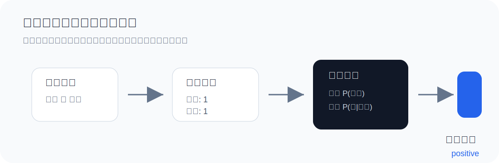

# 跟天 jiang 一起学 NLP


这是 B 站系列课程「跟天 jiang 一起学 NLP」的配套资料仓库。这里会把每一讲的视频重点、代码示例、公式直觉和练习任务整理成可以复习、可以运行、也可以继续扩展的小项目。

第一讲已经上线：从最经典的文本分类基线模型 **朴素贝叶斯** 开始，理解计算机如何把文字变成数字，再用概率判断一句话更像哪一类。

## 课程路线

| 讲次 | 主题 | 关键词 | 状态 |
| --- | --- | --- | --- |
| 01 | [朴素贝叶斯文本分类](docs/lecture-01-naive-bayes.md) | 词袋模型、先验概率、条件概率、拉普拉斯平滑 | 已更新 |
| 02 | 待定 | 分词、N-gram、特征工程 | 准备中 |
| 03 | 待定 | 向量化、TF-IDF、分类评估 | 准备中 |

## 第一讲你会学到什么



- 为什么 NLP 的第一步通常是把文字转换成向量。
- 什么是词袋模型，以及它为什么会丢失语序信息。
- 朴素贝叶斯如何组合「类别先验」和「词语证据」。
- 为什么要做拉普拉斯平滑，避免没见过的词把概率归零。
- 如何用 Python 写一个极简的多项式朴素贝叶斯分类器。

## 快速开始

本仓库当前不需要额外安装依赖，直接使用 Python 3 即可运行第一讲示例。

```bash
python3 naive_bayes.py
```

你会看到类似输出：

```text
开始训练...
词表大小：22
类别统计：{'positive': 3, 'negative': 3}
准确率：100.00%
预测：这 部 电影 很 好看 -> positive
预测：剧情 拖沓 很 无聊 -> negative
```

也可以使用示例 TSV 数据：

```bash
python3 naive_bayes.py --train examples/movie_reviews.tsv --test examples/movie_reviews.tsv
```

TSV 文件格式如下：

```text
positive	这 部 电影 很 精彩
negative	剧情 无聊 表演 很 差
```

## 仓库结构

```text
.
├── README.md
├── naive_bayes.py
├── assets/
│   ├── hero-nlp.svg
│   ├── bayes-flow.svg
│   ├── bow-example.svg
│   └── naive-bayes-prior.png
├── docs/
│   └── lecture-01-naive-bayes.md
└── examples/
    └── movie_reviews.tsv
```

## 学习建议

先读讲义，再跑代码。读讲义时重点抓住三个问题：文本如何变成数字、概率如何累加证据、平滑为什么必要。跑代码时可以改 `examples/movie_reviews.tsv` 里的句子，观察词表、类别统计和预测结果怎么变化。

## 更新计划

- 补充每一讲的视频链接和 B 站分集目录。
- 为后续章节增加更完整的数据集读取方式。
- 逐步加入 TF-IDF、Word2Vec、Transformer 等主题示例。
- 每讲配套一个小练习，方便边看边改代码。
