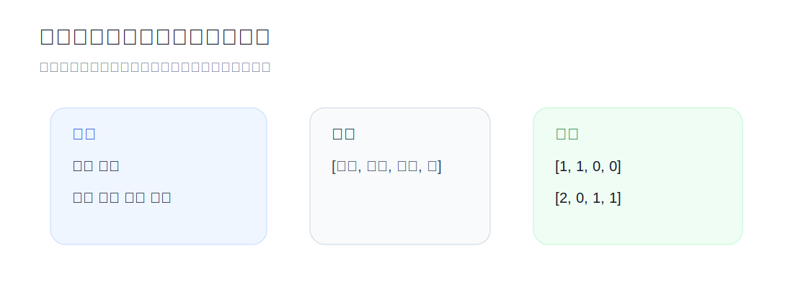
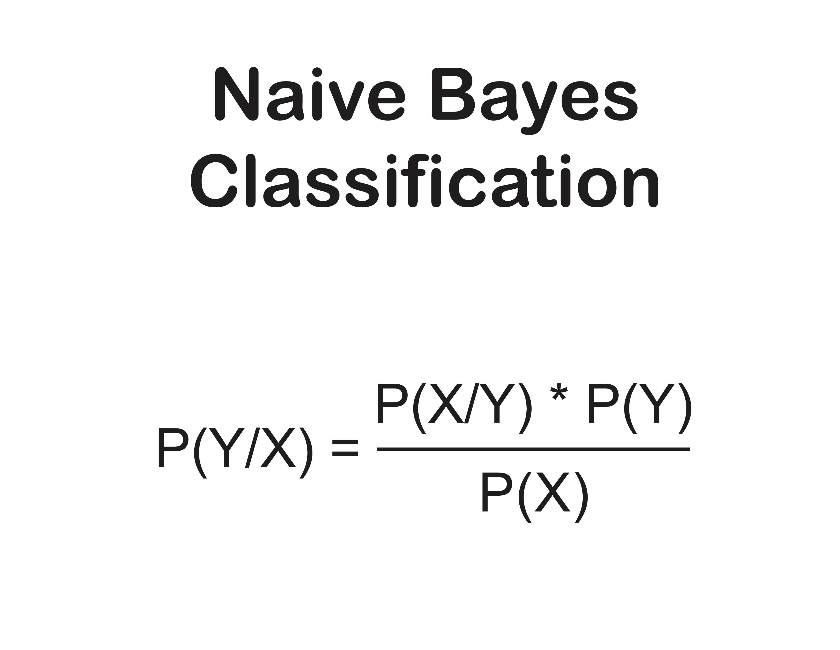

# 第一讲：朴素贝叶斯文本分类



朴素贝叶斯是一种基于 **贝叶斯定理** 的概率分类算法。它的核心想法很直接：先观察训练数据里每个类别和每个词出现的频率，再用这些频率估计一段新文本属于某个类别的概率。

在 NLP 里，它常被用作文本分类任务的基线模型。模型虽然简单，却能帮我们看清自然语言处理的第一层逻辑：机器不直接理解句子含义，而是先把文字转换成可计算的特征，再用统计规律做判断。

## 它在 NLP 中如何思考

1. **特征提取**：把文本转换成数字。第一讲使用最经典的词袋模型，也就是统计每个词出现了几次。
2. **概率学习**：从训练集里学习某个词在某个类别中出现的概率，例如「精彩」更常出现在正面评论里。
3. **预测推断**：给定一条新文本，分别计算它属于每个类别的分数，选择分数最高的类别。

## 词袋模型

词袋模型可以想象成一个透明袋子：我们把一句话拆成词，然后只统计每个词出现了几次，不关心语序和语法。

| 句子 | 苹果 | 好吃 | 讨厌 | 吃 | 向量表示 |
| --- | ---: | ---: | ---: | ---: | --- |
| 苹果好吃 | 1 | 1 | 0 | 0 | `[1, 1, 0, 0]` |
| 不吃苹果，讨厌苹果 | 2 | 0 | 1 | 1 | `[2, 0, 1, 1]` |

词袋模型的优点是简单、稳定、容易解释；缺点也很明显：它会丢失语序。因此「我不爱你」和「不，我爱你」可能会变得非常相似。后续课程会讲 N-gram，用相邻词组合保留一部分语序信息。

## 为什么文本分类常用多项式朴素贝叶斯

朴素贝叶斯有多个版本。文本分类里常见的是 **Multinomial Naive Bayes**，也就是多项式朴素贝叶斯。

- 它关心词出现的次数，而不只是出现或没出现。
- 如果一封邮件里「中奖」出现了 10 次，它会比只出现 1 次时提供更强的证据。
- 这很适合词袋模型，因为词袋向量本身记录的就是词频。

## 训练：建立记忆

训练阶段主要是在数数。代码里会保存三类信息：

- `doc_counts`：每个类别有多少篇文档，用来估计先验概率。
- `word_counts`：每个类别里，每个词出现了多少次，用来估计条件概率。
- `vocab`：训练集中出现过的所有词，用来计算平滑后的概率。

```python
self.doc_counts[label] += 1
self.word_counts[label].update(words)
self.total_words[label] += len(words)
self.vocab.update(words)
```

如果训练集里正面评论和负面评论各有 3 条，那么模型还没看文本内容时，会认为两个类别的先验概率一样。如果正面评论占 80%，模型就会天然更偏向正面。

## 预测：累加证据

预测时，模型会给每个类别算一个分数：

```python
score = math.log(self.doc_counts[label] / self.total_docs)
```

这是类别的起步分，也就是先验概率 $P(Category)$。



然后模型会扫描输入文本里的每个词，计算这个词在当前类别下出现的概率：

```python
likelihood = (count + self.alpha) / denominator
score += math.log(likelihood)
```

这里使用 `math.log` 是为了把很多很小的概率连乘，转换成对数分数的累加。这样既不容易数值下溢，也更方便比较。

## 拉普拉斯平滑

如果一个词从没在某个类别里出现过，原始概率会变成 0。概率一旦乘上 0，整条文本的类别分数就会归零，这显然太粗暴。

所以我们给每个词都加上一点点默认次数：

```python
(count + alpha) / (total_words + alpha * vocab_size)
```

当 `alpha = 1` 时，这就是常见的拉普拉斯平滑。它的意思是：就算模型没见过这个词，也先给它一个很小但不为 0 的概率。

## 评估：考试时间

训练完成后，我们用模型没有见过的测试集来评估准确率：

```python
def evaluate(self, corpus):
    correct = 0
    total = 0
    for text, label in corpus:
        correct += self.predict(text) == label
        total += 1
    return correct / total
```

准确率的含义就是：猜对的样本数除以总样本数。

## 运行代码

```bash
python3 naive_bayes.py
```

使用自定义 TSV 文件：

```bash
python3 naive_bayes.py --train examples/movie_reviews.tsv --test examples/movie_reviews.tsv
```

TSV 每行由标签和文本组成，中间用 Tab 分隔：

```text
positive	这 部 电影 很 精彩 演员 表演 真 好
negative	电影 太 糟糕 剧情 无聊
```

## 小练习

- 在 `examples/movie_reviews.tsv` 里添加更多正面和负面句子，观察准确率是否变化。
- 把同一个关键词重复多次，比如「无聊 无聊 无聊」，看看多项式模型的预测是否更坚定。
- 改变 `NaiveBayes(alpha=1.0)` 的 `alpha`，观察平滑强度对预测的影响。

朴素贝叶斯不是今天最强的 NLP 模型，但它是理解文本分类的一块好地基。学会它之后，再看 TF-IDF、逻辑回归、BERT 或 GPT，会更容易理解这些模型到底在继承和改造什么。
